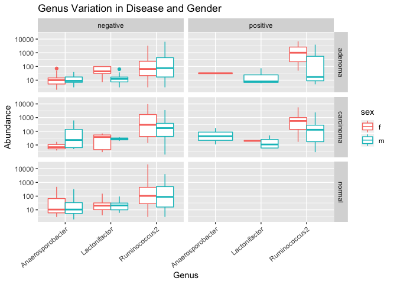
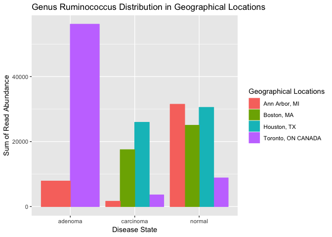

Final Report: Your Title Here
================
Don Francisco
December 5, 2018

Introduction
============

Add about 2-3 pages here. Across the whole manuscript, you should cite at least 20 peer reviewed articles.

Microbial community has constantly interact with human communities and there are both benefits and harms can be done to human health by different bacteria. For instance, microbial community in human's gut is a typical example of how the human can benefit from bacteria. The microbial community in human's gut support metabolic activities, which will help the provide energy and provide nutrients for human's body. The microbial community in the gut also help provide immune protection against alien microbes (McMurdie and Holmes, 2013). However, microbial community can also be related to colon cancer. Worldwide, coloretal cancer has accounted for over a half million death annually, which is the third most commonly diagnosed malignancy (Parkin *et al.*, 2005). There two major stages of correctional cancer development, firstly, it start with the precancerous adenomatous polyps in the colon, which is also known as the adenoma. The second stage is the progression into invasive and metastatic cancerous tumor, which is also called carcinoma (Levin *et al.*, 2008). The development of colorectal adenocarcinoma can be caused by the sequenctial or epigenetic mutation in the epithlial cells in the gastronintestinal trait. The mutation modifies the normal epithlial cells into hyperperliferative mucosa, which gives rise to begin adenoma (Pancione *et al.*, 2012). The normal gastonintestinal epithelium differentiate into several epithelial colon lineage including Panteh, goblet, and endocrine cells. They have the function of secret mucosa to lubercate the colon, and provide ptotection and anchor point for bacteria (Kosinski *et al.*, 2007). Thus, if the cancer causing mutation, alternated the function of colon epithelial cells, there is a chance of changing the microbial community in the colon. Therefore, the abundance and composition of gastrointestinal mirobal coomunity may serve as an indication of cancer development. Due to the early diagnosis, the colorectal cancer have a steady decrease of death rate in the United States.

Along with the fast development of sequencing techniques, the sequence and investigation on microbial communities have expanded extensively. High-throughput sequencing, also known as the Next Generation Sequencing(NGS) technology, that used the non-Sanger-based method to enable an unprecedented DNA sequencing speed. This also allows the novel biological sequencing applications. For example, 454 technique is known to have a crucial advantage of combing the emulsion PCR and pyrosequencing. For emulsion PCR, the single DNA amplification is a bias-free process, by avoiding the competition by multiple templates for a limited amount of DNA polymerase. Pyrosequencing, can be performed in parallel and produce a visual signal via computer system (Schuster, 2007). The next generation sequencing technique makes the DNA sequencing faster, which generates significantly more data for scientists to process. Thus, to process the massive amount of data, different methods are developed. One of the example and will be used in this paper is the Phylogenetic Sequencing (Phyloseq), which is a contingency table of taxonomic and samples, and integrate with other data types. This can be applied along with the powerful statistical and graphical tool R to enable more various data analysis (McMurdie and Holmes, 2013).

For this paper, my primary question of interest is that what are the microbiomes that present differently in adenoma, carcinoma, and normal tissues. Also, what are their functions or relationship to the colorectal cancer. Then examine whether there is a corrolation between bacteria species and the personal variables like BMI, geographical locations and medication. As an result, for adenoma, carcinoma, and normal tissues, there is a simmilar microbial community composition, but there is a different the abundance of each bacteria species. Also, bacterias can function in both directions, aid in cancer progession or help slow down the cancer progession. Lastly, geographical regions and medication will also impact and shape the microbial community in individuals, which can function as an possible prediction and guidence for colorectal cancer treatments.

Eventhough colon has been the part in human body that has most bacteria invloved, but the knowledge of investigating the relationship between cancer and mirobial communities in human bodies can be applied to other types of cancer, both in treatment and preventions.

Methods
=======

Study design
------------

Zacular et al. examined 90 patients feces samples with 30 healthy, 30 colon carcinoma, and 30 colon adenoma to examine how the composition of the microbime will be related to the the colon cancer progression ans whehter the microbime composition will help predict the adenoma and carcinoma lesions. Zacukar et al. also include the factors including BMI, weight, height, geographical location of the patients to further investigate their corrolation with mirobial communities.

Sample origin and sequencing
----------------------------

Approved by the University of Michigan Insititional Review Board and all subjects provided informed consent. Zacular et al. took sample from patients, that were 18 years of age or older, and who could tolerate 58ml of blood removal at two time points, willing to compkete an gFOBT kit, able to provide informed consent, also who had colonoscopy and histologically confirmed colonic disease status. Zacular et al, excluded pateiens who is known to have HIV, chronic vial hepatitis, HNPCC, FAP, inflammatory bowel disease. Or any surgery radiation and chemotherapy for their current colorectal cancer or colonic adenoma. Fecal samples and the colonoscopies were collected and performed respectivly from four subjects of locations including, Toronto Canada, Boston Massachusrtts, USA; Houston Texas, USA; and Ann Arbor Michigan, USA. The colonoscopies were followed by endoscopic examination, and patients who have no colonic abnormalities weer designated as healthy. For examinations that revealed the presence of lesions resulted in a biopsy and subsquence diagnosis of adenoma or carcinoma. All the samples collected from participants were collected following the usual dietary and medication restriction for 24 hours, as a whole evacuated stoll in a hat with no preservatives. The gFOBT 6-Panel kit (Sensa HemocultII, Beckman-coulter) was prepared by patients immediately after the previous collection, from different areas of the stool. The stool was packaged with ice in an insulated box, and shipped to the procesing center aling with the gFOBT cards. Once the sample recieved, the feces samples we stored at -80ºC. The gFOBT was processed and interpreated as asoon as the arrival. If 6 wells we positive on the gFOOBT kit, then the patients will be recorded as FOBT positive. At the time of stool collection, all the participants had intact colonic lesion., and sample was provided 1-2 weeks after the colonscopy preparation. Overall, there was 90 stool samples recieved in total, with 30 healthy, 30 colon adenoma and 30 colon carcinoma samples (Zackular *et al.*, 2014). The DNA extraction of samples used the Power-Soil-htp 96 well Soil DNA Isolation Kit (MO BIO Laboratories), and used EPMotion 5075 piptting system. Then the V4 regions of the 16S rRNA genes inn each samples was amplified and sequenced using Illumina MiSeq Personal Sequencing platofrm (Zackular *et al.*, 2014).

Computational
-------------

I used DADA to analyze and clean the data, then phyloseq and ggplot to visualize the results. Firstly, I ran a quality control on all twenty of the sample data, which generated a quality profile on each of the samples. Then according to the sequence quality, I trimmed the data if they have more than three expected error, and has a quality lower than two. As a quality control, I created a table to compare the read counts before and after the trim to ensure I did not trim off too many sequences. After the trim, I build an error model for each sample to assess the probability of an unmatched base is an error or not, and a plot to check whether the error model matches the data. After it, I also deleted the duplicated sequences. Then as an essential step, I DADA to process the sequence data. DADA is an analysis include the error model and evaluates whether the unique sequence found is true or false. DADA eliminates the false positive results to provide the real variants and limit spurious sequence, to provide a high-resolution amplicon data (Callahan *et al.*, 2016).

Then I listed the output of the DADA analysis on a table according to the variety of length. As well as a histogram to indicate the distribution of the sequence that is trimmed and denoised, to ensure that all the sequences are in acceptable length and quality. Using this output, I also removed all the chimeras, which is the cDNA sequence that generated from two transcripts that is caused by polymerase stuck and ump to another similar sequence. Using the sequence data, I assigned the taxonomy according to the supplied training set. Using the dada2 output, I charted a data set, which contains the metadata for each sample, Phylogeny, and taxonomy for each sequence. The phyloseq pakges was used to import the information, and help analyze the phylogenetic sequence data clustered into Operational Taxonomic Units (OTU) (McMurdie and Holmes, 2013). I also melted the phyloseq data files to enable the ggplot function.

Results
=======

Firstly I was intrerested in how is the distribution of Phylum in different cancer progrssion stages, which includes normal, adenoma, and carcinma. I found that in different types of fecal samples, they had very similar composition of microbia communities, but there are differences in the abundancy of different phlyums. The distribution pattern in three kinds of tisssue samples are very different. The Bacteroidetes abundance decreased in the order normal samples has the highest abundance, then carcinoma and then adenoma samples. Euryarchaeota is in the opposit trending than the Bacteroidets, the abundance increase in the order og normal, carcinoma, and adenoma. Fusobacteria is signficantly more abundant in carcinoma samples. Proteibacteria is more abundant in adenoma and carcinoma samples than the normal samples (Figure 1.). Then I selected thos Phylums that showed a interesting pattern across different sample types to further examine the Class distributions in not normal samples. As well as the corrolation between Class and FOBT resultsAs a results, Bacterioidia has the some abundance in both FOBT positive and negative samples from adenoma, and carcinoma. In both adenoma and carcinoma samples, the FOBT sample had more abundant Fusobacteriia than FOBT negative samples. The Clostridia and Negativicutes had a almost identical abundance in both FOBT positive and negative samples across the disease state. For Gammaproteobacteria, FOBT positive sample in both adenoma and carcinoma had lower abundance (Figure 2.).

Then I selected out Gammaproteobacteria, Clostridia, Fusobacteriia, and Negativicutes to investigate their distribution in FBOT positive samples. Also, the how gender will impact the abunadnce. For Fusobacteriia, there were mostly male samples only. Fusobacteria also had high abundance in carcinoma tissues, and lower in adenoma samples. For Gammaproteobacteria, in both adenoma and carcinoma samples, they had relativly simmilar abundance in both male and female samples. Clostridia had lower abundance in both male adenoma and carcinoma somaples than female. This simmilar to the pattern of Negativicutes, in adenomas samples. Howerver, Negativicutes had significantly higher abundance in male carcinoma than felmale (Figure 3.). Giving Clostridia had a pattern consisitancy in adenoma and carcinoma sample, I then further investigated three specific Genus under Class Clostridia, Family Lachnospiraceae, which are Genus *Lactonifactor*, *Ruminococcus2*, *Anaerosporobacter*, with their abundance under the context of FOBT results and gender. In both male and female, FOBT results created a different abundance of mirobiome in adenoma and carcinoma samples. Within the Family Lachnospiraceae, I filtered serval Genus that has relativily high abundance. *Anaerosporobacter* had similar abundance for male and female in each of FOBT negative sample types, adenoma, carcinoma and normal. Howerver, it is only found in female FOBT positive adenoma samples and male FOBT positive carcinoma samples. *Ruminococcus* was found in similar abundance in FOBT negative samples between male and females. But in the FOBT positive samples, *Ruminococcus* was more abundant in both female adenoma and carcinoma samples than male (Figure 4.).

Since *Ruminococcus* had shown a different pattern between the FOBT positive and negative samples, and gender. I then further examined the geographical location's impact on *Ruminococcus*. For the adenoma samples had *Ruminococcus* detected, the patients are from Toronto or Ann Arbor, But mostly Toronto, ON, Canada. The carcinoma samples were mostly from Boston and Houston patients. For normal healthy samples are more diverse and came from all four different locations (Figure 5.). Lastly, I was interesed to see how different combinations of medication that contains the liptor will influence the *Ruminococcus* abundance in the samples. As the results, for the effect of medication in FOBT negative samples. Female patients who had lipitor ins the treatment, they had raletivly high abundance of *Ruminococcus*, and the average abundance is similar to each other. For male individuals, different combinations of treatment that contains lipitor creates a variation of *Ruminococcus* abundance. Individual had only treated with lipitor had the highest *Ruminococcus* mean abundance, then lipitor with ezetrol and lipitor with metformin and allupurinol had a decrease the *Ruminococcus* abundance. The treatment of lipitor and novasc had significantly lowered the *Ruminococcus* abundance in male adenoma samples (Figure 6.).

Figure 1. In different types of fecal samples, they have very similar composition of microbia communities, but there are differences in the abundancy of different phlyum. The distribution pattern in three kinds of tisssue samples are very different. The Bacteroidetes abundance decreased in the order normal samples has the highest abundance, then carcinoma and then adenoma samples. Euryarchaeota is in the opposit trending than the Bacteroidets, the abundance increase in the order og normal, carcinoma, and adenoma. Fusobacteria is signficantly more abundant in carcinoma samples. Proteibacteria is more abundant in adenoma and carcinoma samples than the normal samples.

    ## Warning: Transformation introduced infinite values in continuous y-axis

    ## Warning: Removed 252679 rows containing non-finite values (stat_boxplot).

Figure 2. Picked out four Phylum that has a diffrent abundance in normal, adenoma, and carcinoma samples. Then examined their corrolation between Class and FOBT results. There are several Class has significant high abundance in the FOBT positive samples. The boxplot help to identify the outliers and the mean vaule of the abundance. As a results, Bacterioidia has the some abundance in both FOBT positive and negative samples from adenoma, and carcinoma. In both adenoma and carcinoma samples, the FOBT sample had more abundant Fusobacteriia than FOBT negative samples. The Clostridia and Negativicutes had a almost identical abundance in both FOBT positive and negative samples across the disease state. For Gammaproteobacteria, FOBT positive sample in both adenoma and carcinoma had lower abundance.

    ## Warning: Transformation introduced infinite values in continuous y-axis

    ## Warning: Removed 50117 rows containing non-finite values (stat_boxplot).

Figure 3. Filtered out the Class that has a significant difference between samples from differnet cancer progression stages and FOBT results. Thus, to futher analyze the corrolation between microbiome community and the gender. I filtered out the samples that are FOBT positive and catagorized into adenoma and carcinoma samples, colored the gender of the patients. For Fusobacteriia, there were mostly male samples only. Fusobacteria also had high abundance in carcinoma tissues, and lower in adenoma samples. For Gammaproteobacteria, in both adenoma and carcinoma samples, they had relativly simmilar abundance in both male and female samples. Clostridia had lower abundance in both male adenoma and carcinoma somaples than female. This simmilar to the pattern of Negativicutes, in adenomas samples. Howerver, Negativicutes had significantly higher abundance in male carcinoma than felmale.

    ## Warning: Transformation introduced infinite values in continuous y-axis

    ## Warning: Removed 8257 rows containing non-finite values (stat_boxplot).

 Figure 4. In both male and female, FOBT results created a different abundance of mirobiome in adenoma and carcinoma samples. Within the Family Lachnospiraceae, I filtered serval Genus that has relativily high abundance. *Anaerosporobacter* had similar abundance for male and female in each of FOBT negative sample types, adenoma, carcinoma and normal. Howerver, it is only found in female FOBT positive adenoma samples and male FOBT positive carcinoma samples. *Ruminococcus* was found in similar abundance in FOBT negative samples between male and females. But in the FOBT positive samples, *Ruminococcus* was more abundant in both female adenoma and carcinoma samples than male.

 Figure 5. For Genus *Ruminococcus*'s distribution in the FOBT negative samples, colored by the geographical locations. For the adenoma samples had *Ruminococcus* detected, the patients are from Toronto or Ann Arbor, But mostly Toronto, ON, Canada. The carcinoma samples were mostly from Boston and Houston patients. For normal healthy samples are more diverse and came from all four different locations.

    ## Warning: Transformation introduced infinite values in continuous y-axis

    ## Warning: Removed 424 rows containing non-finite values (stat_boxplot).

Figure 6. To further investigate how *Ruminococcus* is impacted by the medication. The medication effects on *Ruminococcus* was only avilable in adenoma samples. This is focused on the effect of medication in FOBT negative samples. In female patients who had lipitor ins the treatment, they had raletivly high abundance of *Ruminococcus*, and the average abundance is similar to each other. For male individuals, different combinations of treatment that contains lipitor creates a variation of *Ruminococcus* abundance. Individual had only treated with lipitor had the highest *Ruminococcus* mean abundance, then lipitor with ezetrol and lipitor with metformin and allupurinol had a decrease the *Ruminococcus* abundance. The treatment of lipitor and novasc had significantly lowered the *Ruminococcus* abundance in male adenoma samples.

Discussion
==========

The result suggested that for microbial have huge vairation of abundance depend on different disease state, gender, FOBT results, geogrphical locations, and medications. The variation of the microbial abundance, while have the sample phlum composition of the microbime can sever as a method too distinguish and even predict the progression stages of the colon cancer. The Fusobacteria has a significan increase in abundace in the carcinoma samples, while in normal and adenoma tissue Fusobacteria remained at a very low concentration (Figure 1.). Thus, if patients has an increase in the Fusobacteria abundance, there might be a risk of develping colon cancer. Or Bacteroidetes is commonly found in colon, human skin even heathly plancenta (Mor and Kwon, 2015), and it is hihgly abundant in normal tissues and experience a decrease in abundance in adenoma and carcinoma samples (Figure 1). Thus, if the fece screening has found a decrease in the Bacterioidetes, then more test might needed to further evaluate teh risk of developing colon cancer. However, the phlyum might be a catagrize with higher uncertainties of which specific bacteria we are looking for and whether other factors plays a important role in the colon cancer. Thus, looking into the class underneath and whether Blood in the fecal samples will aid into the change of micorbiome. The FOBT, fecal occult blood test, has show to corrolate with the mortality of colon cancer. The FOBT positive result might relate the reduceness of mortatlity to colon cancer (Mandel *et al.*, 1993). I found several class of bacteria that has hight abundance in the FOBT positive samples, than the FOBT negative sample, which can be used as another additional screening method for colon cancer. For example, in both adenoma and carcinoma samples, Fusobacteriia and Deltaproteobacteria has found mroe abundant in FOBT positive sample. In contrast Gammaproteobacteria has been found to have lower abundancy in FOBT positive samples (Figure 2). This observation has very much related to the function of the bacteria, which then can even help us provide a more accurate treatment. *Fusobacterium*, the Genus within Class Fusobacteria has been found as a possible opportunistic pathogen located in both mouth and gut that is implicated in inflamatory diseases (Signat *et al.*, 2011). During the cancer progression especially the leasion has caused the bleeding, *Fusobacterium* might participating in indcue the inflmation in the colon. Thus, it is possible to use anti-inflammatory medication to help reduce the sydrome.

There are also a lot of factors other than FOBT test that plays a roke the colon cance progression. I have investigated how Body Mass Index (BMI), the gender, geographical location and medication will impact the mirocbiome distribution pattern. For the BMI, there is no obvious corrolation with the colon cancer development nor the change in the microbime community. As for gender, there are bacteria only has been found in male, Fusobacteria is only found in FOBT positive male samples, and lower abundancy in adenoma than carcinoma (Figure 3). In combination with the previous information, having less abundancy in adenoma indicate less inflammatory is happening in precancerous condition. Also, Fusobacteriia will more likely to be the cause of inlfamation in male than female. For Negativicutes, it is more commonly found in female adenoma than male, but it dramastically decrease in the female carcinoma samples, while only have a slight decrease in male carcinoma samples. Negativicutes is know to aid in the production or convertion of either succinate or lactate to propinoate in the human gut (**???**). The intake of propoinate in colon, will reduce the energy intake and prevent weight gain (Chambers *et al.*, 2015). Thus, females are more vunerable to weight loss, when they develop colon carcinoma.

*Ruminococcus* belongs to the

Sources Cited
=============

Callahan,B.J. *et al.* (2016) DADA2: High-resolution sample inference from illumina amplicon data. *Nature Methods*, **13**, 581–583.

Chambers,E.S. *et al.* (2015) Effects of targeted delivery of propionate to the human colon on appetite regulation, body weight maintenance and adiposity in overweight adults. *Gut*, **64**, 1744–1754.

Kosinski,C. *et al.* (2007) Gene expression patterns of human colon tops and basal crypts and bmp antagonists as intestinal stem cell niche factors. *Proceedings of the National Academy of Sciences*, **104**, 15418–15423.

Levin,B. *et al.* (2008) Screening and surveillance for the early detection of colorectal cancer and adenomatous polyps, 2008: A joint guideline from the american cancer society, the us multi-society task force on colorectal cancer, and the american college of radiology. *CA: a cancer journal for clinicians*, **58**, 130–160.

Mandel,J.S. *et al.* (1993) Reducing mortality from colorectal cancer by screening for fecal occult blood. *New England Journal of Medicine*, **328**, 1365–1371.

McMurdie,P.J. and Holmes,S. (2013) Phyloseq: An r package for reproducible interactive analysis and graphics of microbiome census data. *PLoS ONE*, **8**, e61217.

Mor,G. and Kwon,J.-Y. (2015) Trophoblast-microbiome interaction: A new paradigm on immune regulation. *American journal of obstetrics and gynecology*, **213**, S131–S137.

Pancione,M. *et al.* (2012) Genetic and epigenetic events generate multiple pathways in colorectal cancer progression. *Pathology research international*, **2012**.

Parkin,D.M. *et al.* (2005) Global cancer statistics, 2002. *CA: a cancer journal for clinicians*, **55**, 74–108.

Schuster,S.C. (2007) Next-generation sequencing transforms today’s biology. *Nature methods*, **5**, 16.

Signat,B. *et al.* (2011) Role of fusobacterium nucleatum in periodontal health and disease. *Curr Issues Mol Biol*, **13**, 25–36.

Zackular,J.P. *et al.* (2014) The human gut microbiome as a screening tool for colorectal cancer. *Cancer prevention research*.
