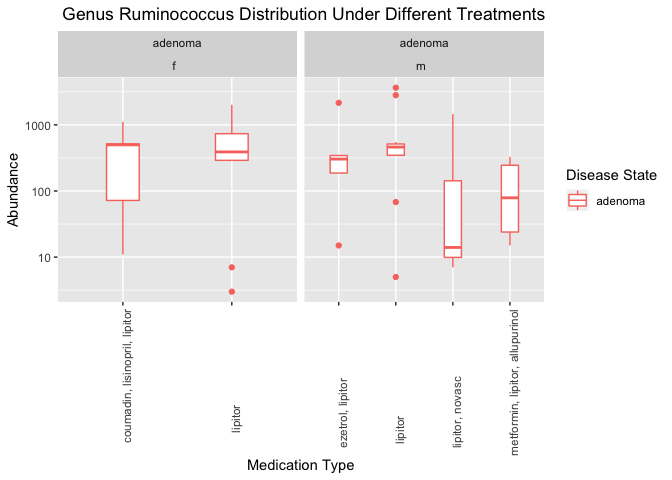

Use Microbiome Distribution Pattern and Abundancy Change to Predict and Treat Colonrectal Cancer
================
Maggie Chen
December 5, 2018

Introduction
============

Microbial communities have interacted with human communities continuously, and there are both benefits and harms can be done to human health by different bacteria. Not limited to the surface of the human body, internally bacteria also have an indispensable role in maintaining normal function and development of the human body (Sommer *et al.*, 2016). For instance, the microbies in the human gut represent a typical example of how humans can benefit from bacteria. The gut community supports metabolic activities, which help provide energy and nutrients for human's body. The gut community in the gut also help provide immune protection against alien microbes (McMurdie and Holmes, 2013). Within the adult gastrointestinal tract, the colon has the densest microbial community. In the luminal content there are than 10^11 bacteria per ml (Whitman *et al.*, 1998). However, the microbial community can also cause diseases. Examples include inflammatory bowel diseases, allergies, and colorectal cancer, which are due to changes in gut microbiome composition, and behavior disorder like depression (Vos and Vos, 2012).

Worldwide, colorectal cancer accountes for over a half million deaths annually, making it the third most commonly diagnosed malignancy (Parkin *et al.*, 2005). There are two major stages of colorectal cancer development. Firstly, precancerous adenomatous polyps develop in the colon. These also known as the adenomas. In the second stage, the adenoma progresses into an invasive and metastatic cancerous tumor, called carcinoma (Levin *et al.*, 2008). The development of colorectal adenocarcinoma can be caused by the sequential or epigenetic mutation in the epithelial cells in the gastrointestinal tract. The mutation modifies the normal epithelial cells into hyperproliferative mucosa, which gives rise to benign adenoma (Pancione *et al.*, 2012). The normal gastrointestinal epithelium differentiates into several epithelial colon lineages including pantech, goblet, and endocrine cells. They secrete mucosa to lubricate the colon and provide protection and anchor points for bacteria (Kosinski *et al.*, 2007). Thus, if a cancer-causing mutation changes the function of colon epithelial cells, there is a chance of altering the microbial community in the colon. Therefore, the abundance and composition of the gastrointestinal microbial community may serve as an indication of cancer development. Due to increase in early diagnosis, the deathes due to colorectal cancer have been decreasing in the United States. Current colon cancer screening and prediction methods include detecting gene mutation or methylation of specific genes that are related to colon cancer development (Kandimalla *et al.*, 2017). Alternatively, to identify the prognostic micro RNA to predict the risk of developing colon cancer (Goossens-Beumer *et al.*, 2015).

Along with the rapid development of gene sequencing techniques, sequencing of microbial communities was also expanded extensively. High-throughput sequencing, also known as the Next Generation Sequencing (NGS) uses the non-Sanger-based methods to enable unprecedented DNA sequencing speed. This allows for novel biological sequencing applications. For example, 454, combines the emulsion PCR and pyrosequencing. For emulsion PCR, the single DNA amplification is a biases are reduced by avoiding the competition by multiple templates for a limited amount of DNA polymerase. Pyrosequencing, can be performed in parallel and produce a visual signal via computer system (Schuster, 2007). This next generation sequencing technique makes the DNA sequencing faster, which generates significantly more data for scientists to process. Thus, to process the massive amount of data, different methods have been developed. This can be applied along with the powerful statistical and graphical R programing language for various data analysis (McMurdie and Holmes, 2013).

Thus, utilizing sequencing technologies and analysis tools, it is possible to examine colon cancer from a new perspective: correlation between microbiome composition and changes in cancer progression. For this paper, my primary question of interest is: what is the composition of the microbiomes that present in adenoma, carcinoma, and normal tissues. I will also examine whether there is a correlation between bacteria species and the personal variables like BMI, geographical locations and medication. I found that, for adenoma, carcinoma, and normal tissues, there is a similar microbial community composition, but differences in the abundance of each bacteria species. I also found that, bacteria can function in both directions, aid in cancer progression or help slow down the cancer progression. In addition, geographical regions and medication will also impact the microbial community in individuals, which can function as a possible prediction and guidance for colorectal cancer treatments. The knowledge of investigating the relationship between cancer and microbial communities in human bodies can be applied to other types of cancer, both in treatment, prediction and prevention.

Methods
=======

Study design
------------

Zackular *et al.* examined 90 feces samples with 30 from healthy individuals, 30 from colon carcinoma patients, and 30 from colon adenoma patients to examine how the composition of the microbiome is related to the colon cancer progression. Zackular *et al.* also related factors including BMI, weight, height, geographical location of the patients to further investigate their correlation with microbial communities. For this paper, I used the sequence data and the metadata from Zackular *et al.*'s paper. Then analyzed the sequence data using DADA2, phlyoseq and R studio.

Sample origin and sequencing
----------------------------

Zackular *et al.* took samples from patients, that were: 18 years of age or older, and who could tolerate 58ml of blood removal at two time points. There were a few more requirements for the participants need to fulfill, including willing to complete a gFOBT kit, able to provide informed consent, and who had a colonoscopy and histologically confirmed colonic disease status. Zackular *et al.*, excluded patients who were known to have HIV, chronic viral hepatitis, HNPCC, FAP, inflammatory bowel disease, as well as, any surgery radiation and chemotherapy for their current colorectal cancer or colonic adenoma. Fecal samples and the colonoscopies were collected and performed from four subjects of locations including, Toronto Canada; Boston Massachusetts, USA; Houston Texas, USA; and Ann Arbor Michigan, USA. The colonoscopies were followed by an endoscopic examination and patients who had no colonic abnormalities were designated as healthy. Examinations that revealed the presence of lesions resulted in a biopsy and subsequent diagnosis of adenoma or carcinoma.

All the samples were collected as a whole evacuated stool with no preservatives following the usual dietary and medication restriction for 24 hours. The gFOBT 6-Panel kit (Sensa HemocultII, Beckman-coulter) was prepared by patients immediately after the previous collection, from different areas of the stool. The stool was packaged with ice in an insulated box and shipped to the processing center to align with the gFOBT cards. Once the samples were received, were stored at -80ºC. The gFOBT was processed and interpreted as soon as the arrival. If 6 wells we positive on the gFOOBT kit, then the patients were recorded as FOBT positive. At the time of stool collection, all the participants had intact colonic lesions. Samples were provided 1-2 weeks after the colonoscopy preparation. Overall, there were 90 stool samples received in total, with 30 healthy, 30 colon adenoma and 30 colon carcinoma samples (Zackular *et al.*, 2014). The DNA extraction of samples used the Power-Soil-htp 96 well Soil DNA Isolation Kit (MO BIO Laboratories), and used EPMotion 5075 piptting system. Then the V4 regions of the 16S rRNA genes in each sample was amplified and sequenced using Illumina MiSeq Personal Sequencing platform (Zackular *et al.*, 2014).

Computational
-------------

I used DADA2 \[callahan2016\] to analyze and clean the data, then phyloseq (McMurdie and Holmes, 2013) and ggplot to visualize the results (Wickham, 2010). Firstly, I used a bash script to download the data set. Then I ran a quality check on a few sample data, which generated a quality profile on each of the samples. Then according to the sequence quality, I trimmed the data if they were predicted to have more than three expected error, then a quality score lower than two. As a quality control, I created a table to compare the read counts before and after the trim to ensure I did not trim off too many sequences. After the trim, I used DADA to build an error model to assess the probability that an unmatched base is an error, and a plot to verify that the error model matches the data (Callahan *et al.*, 2016). I deleted duplicated sequences. Then I used DADA to process the sequence data. DADA is an analysis approach that includes error model and evaluates whether the unique sequences are due to errors or if they are real (Callahan *et al.*, 2016). DADA eliminates the false positive results to provide the real variants and limit spurious sequence (Callahan *et al.*, 2016). Then I listed the output of the DADA analysis on a table according to the variety of length (Callahan *et al.*, 2016). I also removed chimeras, which are cDNA sequences generated from two template sequence. Using the ASV sequence data, I then assigned the taxonomy according to the supplied training set. The phyloseq packge was used to import the visualize information (McMurdie and Holmes, 2013).

Results
=======

Firstly I was interested in the distribution of Phyla varied across different cancer progression stages, includes normal, adenoma, and carcinoma. I found that different types of fecal samples, had very similar microbial communities composition, but there were differences in the abundance of different Phyla. The distribution pattern across three kinds of samples were very different. The abundance of Bactericides decreased from the normal samples tho carcinoma and then to adenoma samples, which had the lowest abundance. Euryarchaeota had an opposite trend with the abundance increasing from normal, to carcinoma, and then to adenoma. Fusobacteria were significantly more abundant in carcinoma samples. Proteobacteria is more abundant in adenoma and carcinoma samples than the normal samples (Figure 1). Next, I selected phyla that showed an interesting pattern across different sample types further analyzed Class distributions. Bacterioidia has same abundance in both FOBT positive and negative samples from adenoma and carcinoma. In both adenoma and carcinoma samples, FOBT positive samples had higher Fusobacteria abundance than FOBT negative samples. The Clostridia and Negativicutes had an almost identical abundance in both FOBT positive and negative samples across the disease state. For Gammaproteobacteria, FOBT positive sample in both adenoma and carcinoma had a lower abundance than FOBT negative samples (Figure 2).

I then selected out Gammaproteobacteria, Clostridia, Fusobacteriia, and Negativicutes to investigate their distribution in FBOT positive samples, and to determine how gender will impact the abundance of taxa. Fusobacteriia were highlt abundant in carcinoma tissues, and lower in adenoma samples. For Gammaproteobacteria, in both adenoma and carcinoma samples, had relatively similar abundance in both male and female samples. Clostridia occured in lower abundance in both male adenoma and carcinoma samples than in female samples. This is similar to the pattern of Negativicutes in adenomas samples. However, Negativicutes had significantly higher abundance in male carcinoma samples than in female samples (Figure 3). As Clostridia had a pattern consistency in adenoma and carcinoma sample, I then further investigated three specific genera within Clostridia, Lachnospiraceae, which are genus *Lactonifactor*, *Ruminococcus2*, *Anaerosporobacter*, with their abundance under the context of FOBT results and gender. *Anaerosporobacter* had a similar abundance for male and female in each of FOBT negative sample types, adenoma, carcinoma and normal. However, this taxa is only found in female FOBT positive adenoma samples and male FOBT positive carcinoma samples. *Ruminococcus* was found in similar abundance in FOBT negative samples between male and females. However, in the FOBT positive samples, *Ruminococcus* was more abundant in both female adenoma and carcinoma samples than male (Figure 4).

Since *Ruminococcus* exhibited a different pattern between the FOBT positive and negative samples, and gender. I then chose to further examined the geographical location's impact on *Ruminococcus* abundance. For the adenoma samples with *Ruminococcus* detected, the patients are from Toronto or Ann Arbor, But mostly Toronto, Canada. The carcinoma samples were mostly from Boston and Houston patients. Normal healthy samples were found in all four locations (Figure 5). Lastly, I was interested to see how different combinations of medication that contains the liptor will influence the *Ruminococcus* abundance in the samples. As the results, for the effect of medication in FOBT negative samples. Female patients who took Lipitor were found to have a relatively high abundance of *Ruminococcus*, and the average abundance is similar to each other. For male individuals, different combinations of treatment that contains Lipitor create a variation of *Ruminococcus* abundance. Individuals had only treated with Lipitor had the highest *Ruminococcus* mean abundance, then Lipitor with ezetrol and Lipitor with metformin and allopurinol had a decrease the *Ruminococcus* abundance. The treatment of Lipitor and novasc had significantly lowered the *Ruminococcus* abundance in male adenoma samples (Figure 6).

Figure 1. In different types of fecal samples, had very similar microbial communities composition, but there were differences in the abundance of different Phyla. The distribution pattern across three kinds of samples were very different. The abundance of Bactericides decreased from the normal samples tho carcinoma and then to adenoma samples, which had the lowest abundance. Euryarchaeota had an opposite trend with the abundance increasing from normal, to carcinoma, and then to adenoma. Fusobacteria were significantly more abundant in carcinoma samples. Proteobacteria is more abundant in adenoma and carcinoma samples than the normal samples.

    ## Warning: Transformation introduced infinite values in continuous y-axis

    ## Warning: Removed 252679 rows containing non-finite values (stat_boxplot).

Figure 2. Picked out four Phylum that has a different abundance in normal, adenoma, and carcinoma samples. Then examined their correlation between Class and FOBT results. There are several Class has significant high abundance in the FOBT positive samples. The boxplot help to identify the outlines and the mean value of the abundance. In both adenoma and carcinoma samples, the FOBT sample had more abundant Fusobacteriia than FOBT negative samples. The Clostridia and Negativicutes had a almost identical abundance in both FOBT positive and negative samples across the disease state. For Gammaproteobacteria, FOBT positive sample in both adenoma and carcinoma had lower abundance. Bacterioidia has same abundance in both FOBT positive and negative samples from adenoma and carcinoma. In both adenoma and carcinoma samples, FOBT positive samples had higher Fusobacteria abundance than FOBT negative samples. The Clostridia and Negativicutes had an almost identical abundance in both FOBT positive and negative samples across the disease state. For Gammaproteobacteria, FOBT positive sample in both adenoma and carcinoma had a lower abundance than FOBT negative samples.

    ## Warning: Transformation introduced infinite values in continuous y-axis

    ## Warning: Removed 50117 rows containing non-finite values (stat_boxplot).

Figure 3. Filtered out the Class that has a significant difference between samples from different cancer progression stages and FOBT results. Thus, to further analyze the correlation between microbiol community and the gender. I filtered out the samples that are FOBT positive and categorized into adenoma and carcinoma samples, colored the gender of the patients. Fusobacteriia were highlt abundant in carcinoma tissues, and lower in adenoma samples. For Gammaproteobacteria, in both adenoma and carcinoma samples, had relatively similar abundance in both male and female samples. Clostridia occured in lower abundance in both male adenoma and carcinoma samples than in female samples. This is similar to the pattern of Negativicutes in adenomas samples. However, Negativicutes had significantly higher abundance in male carcinoma samples than in female samples

    ## Warning: Transformation introduced infinite values in continuous y-axis

    ## Warning: Removed 8257 rows containing non-finite values (stat_boxplot).

Figure 4. In both male and female, FOBT results created a different abundance of mirobiome in adenoma and carcinoma samples. Within the Family Lachnospiraceae, I filtered serial Genus that has relatively high abundance. *Anaerosporobacter* had similar abundance for male and female in each of FOBT negative sample types, adenoma, carcinoma and normal. However, it is only found in female FOBT positive adenoma samples and male FOBT positive carcinoma samples. *Ruminococcus* was found in similar abundance in FOBT negative samples between male and females. But in the FOBT positive samples, *Ruminococcus* was more abundant in both female adenoma and carcinoma samples than male.

Figure 5. For Genus *Ruminococcus*'s distribution in the FOBT negative samples, colored by the geographical locations. For the adenoma samples had *Ruminococcus* detected, the patients are from Toronto or Ann Arbor, But mostly Toronto, ON, Canada. The carcinoma samples were mostly from Boston and Houston patients. For normal healthy samples are more diverse and came from all four different locations.

    ## Warning: Transformation introduced infinite values in continuous y-axis

    ## Warning: Removed 424 rows containing non-finite values (stat_boxplot).

Figure 6. To further investigate how *Ruminococcus* is impacted by the medication. The medication effects on *Ruminococcus* was only available in adenoma samples. This is focused on the effect of medication in FOBT negative samples. In female patients who had lipitor ins the treatment, they had high abundance of *Ruminococcus*, and the average abundance is similar to each other. For male individuals, different combinations of treatment that contains lipitor creates a variation of *Ruminococcus* abundance. Individual had only treated with lipitor had the highest *Ruminococcus* mean abundance, then lipitor with ezetrol and lipitor with metformin and allupurinol had a decrease the *Ruminococcus* abundance. The treatment of lipitor and novasc had significantly lowered the *Ruminococcus* abundance in male adenoma samples.

Discussion
==========

The result suggested that microbial communities have a vast variation of abundance depending on different disease state, gender, FOBT results, geographical locations, and medications. The variation of the microbial abundance, while have the sample phyla composition of the microbiome can sever as a method to distinguish and even predict the progression stages of the colon cancer. The Fusobacteria has a significant increase in abundance in the carcinoma samples, while in normal and adenoma tissue Fusobacteria remained at a very low concentration (Figure 1.). Thus, if patients have an increase in the Fusobacteria abundance, there might be a risk of developing colon cancer. Bacteroidetes is commonly found in the colon, human skin even healthy placenta (Mor and Kwon, 2015), and it is highly abundant in normal tissues and experience a decrease in abundance in adenoma and carcinoma samples (Figure 1). Thus, if the feces screening has found a decrease in the Bacterioidetes, then more test might be needed to further evaluate the risk of developing colon cancer. However, the phylum might be a categorize with higher uncertainties of which specific bacteria we are looking for and whether other factors plays a critical role in colon cancer. Thus, looking into the class underneath and whether Blood in the fecal samples will aid into the change of microbiome. The FOBT, fecal occult blood test, has shown to correlate with the mortality of colon cancer. The FOBT positive result might relate to the reduction of mortality to colon cancer (Mandel *et al.*, 1993). I found several classes of bacteria that has a higher abundance in the FOBT positive samples, than the FOBT negative sample, which can be used as another additional screening method for colon cancer. For example, in both adenoma and carcinoma samples, Fusobacteriia and Deltaproteobacteria have found more abundant in FOBT positive sample. In contrast, Gammaproteobacteria has been found to have lower abundance in FOBT positive samples (Figure 2). This observation has very much related to the function of the bacteria, which then can even help us provide a more accurate treatment. *Fusobacterium*, the Genus within Class Fusobacteria has been found as a possible opportunistic pathogen located in both mouth and gut that is implicated in inflammatory diseases (Signat *et al.*, 2011). During the cancer progression especially if the lesion has caused the bleeding, *Fusobacterium* might participate in inducing the inflammation in the colon. Thus, it is possible to use anti-inflammatory medication to help reduce the syndrome.

There are also a lot of factors other than FOBT test that plays a role the colon cancer progression. I have investigated how the Body Mass Index (BMI), the gender, geographical location and, medication will impact the microbiome distribution pattern. For the BMI, there is no obvious correlation with the colon cancer development nor the change in the microbiome community. As for gender, Fusobacteria is only found in FOBT positive male samples with lower abundance in adenoma than carcinoma (Figure 3). In combination with the previous information, having less abundance in adenoma indicate less inflammation is happening in precancerous condition. Also, Fusobacteria will more likely to be the cause of inflammation in male than female. For Negativicutes, it is more commonly found in female adenoma than male, but it dramatically decreases in the female carcinoma samples, while only have a slight decrease in male carcinoma samples. Negativicutes is known to aid in the production or conversion of either succinate or lactate to propionate in the human gut (Reichardt *et al.*, 2014). The intake of propoinate in the colon, will reduce energy intake and prevent weight gain (Chambers *et al.*, 2015). Thus, females are more vulnerable to weight loss, when they develop colon carcinoma.

Family Lachnospiraceae has been known to help maintain the gut health as active plant degraders (Biddle *et al.*, 2013). All the Genus in the Family has decreased abundance in the FOBT postive samples, but not necessary in adenoma and carcinoma (Figure 4). This is an indication that the FOBT positive is a relatively strong reflection of the decrease of the health of the colon, in colon cancer progression. Thus, if a patient has a decrease in the abundance of Lachonospiraceae, then extra attention is needed to maintain gut health and function. *Ruminococcus* is the Genus that belongs to the Family Lachnospiraceae, which has a particular geographic distribution that relate to the colon cancer progression. *Ruminococcus* is only commonly found in adenoma samples of patients that are from Toronto, Canada. *Ruminococcus* is only found in carcinoma samples from patients in Boston and Huston, USA. In contrast, *Ruminococcus* is found in normal samples for people from all four locations (Figure 5). This is an indication that different diet at different geographic locations will somehow shape the microbiome in adenoma and carcinoma cancer progressions. This also an indication that, while using microbiome as a screening tool to predict and treat colon cancer, we have to consider both progression stages and the region the patients come from. To provide more accurate prediction and more effective treatments. What's more, it also possible that different dietary restirction or locations can cause various mutations, which might induce the chance of getting colon cancer and alter the microbiome differently (Janout *et al.*, 2001).

Lastly, the medication will alternate the microbiome composition as well. Lipitor is a medication commonly used by patients in the experiment. Lipitor is the brand name for Atorvastatin, which has commonly known to be used for lowing blood cholesterol and prevent cardiovascular disease. However, it has recently been found to prevent colon carcinogenesis (Wu *et al.*, 2015). This matches up with my observation that *Ruminococcus* abundance under different treatment effects was only available for adenoma samples, Lipitor might be used to prevent the colon cancer progression to carcinoma (Figure 6). Also, I investigated how different medication combination with Lipitor will impact the *Ruminococcus* abundance. The *Ruminococcus* remains at a relatively high level across treatments and gender. Except for male individual treated norvasc, methoformim and allupurinal (Figure 6). The medications are not specific to colon cancer, There might be a side effect of combing different medications, which lead to the decrease of the *Ruminococcus* abundance. However, this needs more investigation on the effects of medications on each other.

There are several limitations of this paper - the major one being that all the prediction and investigation on the microbiome community are based on fecal samples. However, there is a possibility that in the colon cancer tissues there are some unique bacteria than the fecal samples. For carcinoma patients, we do not have the stage information, which can be very helpful in order to provide a more detailed analysis. There is also some more information we can collect from patients, like whether they have dietary restriction, and what are the common types of food they consume on a daily basis are. For the medication information, some medications are not targeting colon cancer. Therefore, information about some other disease the patients have might be helpful to make more sense of the mediation combination and their effects on microbiome composition.

In summary, in order to use the distribution pattern and abundance change of microbiomes to predict and treat different progression stages of the colon cancer, there are many parameters need to be taken into consideration. Also, we need a sufficient amount of understanding of bacteria functions in the colon. As a result, using gender, geographical information can help us identify some key species of bacteria and further understand the relationship with the colon cancer. It is highly possible that we can develop a module in incorporate all the parameters to predict the development and risk of colon cancer or to provide more accurate treatment to improve the survival rate of the colon cancer. What's more, the same method can also be applies to other types of disease for alternative treatments.

Sources Cited
=============

Biddle,A. *et al.* (2013) Untangling the genetic basis of fibrolytic specialization by lachnospiraceae and ruminococcaceae in diverse gut communities. *Diversity*, **5**, 627–640.

Callahan,B.J. *et al.* (2016) DADA2: High-resolution sample inference from illumina amplicon data. *Nature Methods*, **13**, 581–583.

Chambers,E.S. *et al.* (2015) Effects of targeted delivery of propionate to the human colon on appetite regulation, body weight maintenance and adiposity in overweight adults. *Gut*, **64**, 1744–1754.

Goossens-Beumer,I.J. *et al.* (2015) MicroRNA classifier and nomogram for metastasis prediction in colon cancer. *Cancer Epidemiology and Prevention Biomarkers*, **24**, 187–197.

Janout,V. *et al.* (2001) Epidemiology of colorectal cancer. *Acta-Universitatis Palackianae Olomucensis Facultatis Medicae*, 5–10.

Kandimalla,R. *et al.* (2017) Methylation of wnt target genes axin2 and dkk1 as robust biomarkers for recurrence prediction in stage ii colon cancer. *Oncogenesis*, **6**, e308.

Kosinski,C. *et al.* (2007) Gene expression patterns of human colon tops and basal crypts and bmp antagonists as intestinal stem cell niche factors. *Proceedings of the National Academy of Sciences*, **104**, 15418–15423.

Levin,B. *et al.* (2008) Screening and surveillance for the early detection of colorectal cancer and adenomatous polyps, 2008: A joint guideline from the american cancer society, the us multi-society task force on colorectal cancer, and the american college of radiology. *CA: a cancer journal for clinicians*, **58**, 130–160.

Mandel,J.S. *et al.* (1993) Reducing mortality from colorectal cancer by screening for fecal occult blood. *New England Journal of Medicine*, **328**, 1365–1371.

McMurdie,P.J. and Holmes,S. (2013) Phyloseq: An r package for reproducible interactive analysis and graphics of microbiome census data. *PLoS ONE*, **8**, e61217.

Mor,G. and Kwon,J.-Y. (2015) Trophoblast-microbiome interaction: A new paradigm on immune regulation. *American journal of obstetrics and gynecology*, **213**, S131–S137.

Pancione,M. *et al.* (2012) Genetic and epigenetic events generate multiple pathways in colorectal cancer progression. *Pathology research international*, **2012**.

Parkin,D.M. *et al.* (2005) Global cancer statistics, 2002. *CA: a cancer journal for clinicians*, **55**, 74–108.

Reichardt,N. *et al.* (2014) Phylogenetic distribution of three pathways for propionate production within the human gut microbiota. *The ISME journal*, **8**, 1323.

Schuster,S.C. (2007) Next-generation sequencing transforms today’s biology. *Nature methods*, **5**, 16.

Signat,B. *et al.* (2011) Role of fusobacterium nucleatum in periodontal health and disease. *Curr Issues Mol Biol*, **13**, 25–36.

Sommer,F. *et al.* (2016) The gut microbiota modulates energy metabolism in the hibernating brown bear ursus arctos. *Cell reports*, **14**, 1655–1661.

Vos,W.M. de and Vos,E.A. de (2012) Role of the intestinal microbiome in health and disease: From correlation to causation. *Nutrition reviews*, **70**, S45–S56.

Whitman,W.B. *et al.* (1998) Prokaryotes: The unseen majority. *Proceedings of the National Academy of Sciences*, **95**, 6578–6583.

Wickham,H. (2010) Ggplot2: Elegant graphics for data analysis. *J Stat Softw*, **35**, 65–88.

Wu,X. *et al.* (2015) Chemopreventive effects of nobiletin and its colonic metabolites on colon carcinogenesis. *Molecular nutrition & food research*, **59**, 2383–2394.

Zackular,J.P. *et al.* (2014) The human gut microbiome as a screening tool for colorectal cancer. *Cancer prevention research*.
